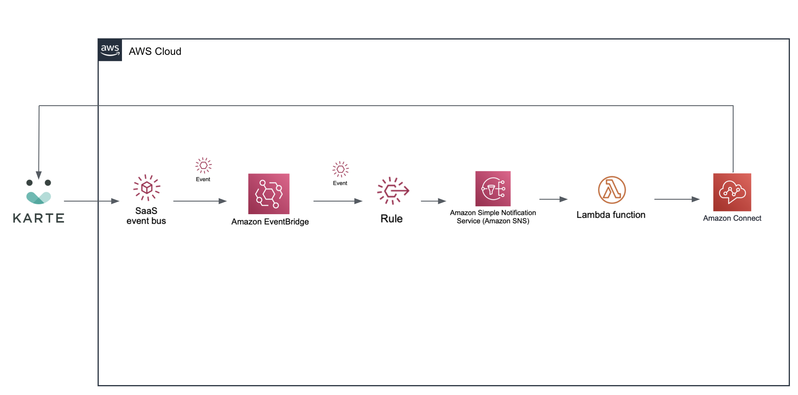

# eventbridge-integration-solution-karte-user-state-driven-call
## Amazon EventBridge Integration: Approach offline end users with Amazon Connect

This Quick Start integrates Amazon Connect, AWS Lambda, AWS SNS, and Amazon EventBridge PLAID KARTE Connect.

By combining KARTE's user data with Amazon Connect, you can create a flow that forwards inquiries to the most appropriate destinations for end users.

To post feedback, submit feature ideas, or report bugs, use the Issues section of [this GitHub repository](https://github.com/aws-quickstart/eventbridge-integration-solution-karte-user-state-driven-call).

