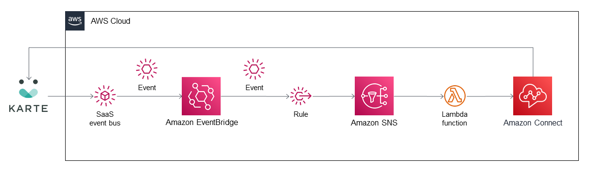

# eventbridge-integration-solution-karte-user-state-driven-call
## Amazon EventBridge Integration for PLAID KARTE Connect

This Amazon EventBridge integration combines the PLAID KARTE software as a service (SaaS) with Amazon Connect, Amazon Web Services (AWS) Lambda, and Amazon EventBridge to route inquiries to the most appropriate destination.

KARTE sends events that contain not only a user’s phone number and ID but also the user’s inquiries and their most recently visited page. For this integration to work, you must add KARTE functionality to your website, which includes a button users can choose when they need help.

To deploy this Amazon EventBridge integration, see [PLAID KARTE Connect](https://aws.amazon.com/quickstart/eventbridge/plaid-karte-connect/)

To post feedback, submit feature ideas, or report bugs, use the Issues section of [this GitHub repository](https://github.com/aws-quickstart/eventbridge-integration-solution-karte-user-state-driven-call).
